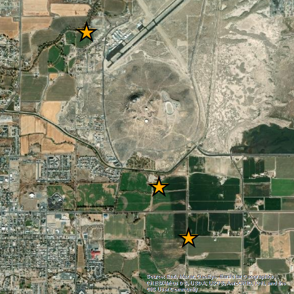
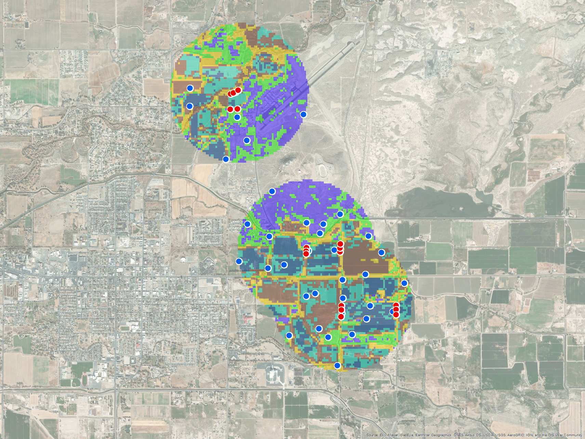

```{r setup, include=FALSE}

knitr::opts_chunk$set(echo = FALSE)
knitr::opts_chunk$set(warning = FALSE)
knitr::opts_chunk$set(message = FALSE)

options(width = 120)

# all setup chunks from the original .Rmd are collapsed into one here (for
# speed)


#library(symengine) # forces installation of cmake on deployment
# load packages ####
library(broom.mixed) # for augment() and tidy() to easily build tibbles
library(car) # for Anova() on lmer model objects
library(emmeans) # for computing SEM marginal means
library(gridExtra) # create multi-panel plots
library(ggridges) # for ggridges plots
library(gtools) # for mixedsort() to arrange factor levels in vegdata tibble
library(hardhat) # for get_levels to extract factor levels in a tidy way
library(knitr) # for knitting R markdown docs
library(lme4) # for univariate mixed-effects models
library(magrittr) # for assignment and exposition pipes ###INSTALL EVERYTHING BELOW HERE!!!!!
library(MuMIn) # model selection tools
library(mvabund) # for building multivariate mods of insect density
library(piecewiseSEM) # for structural equation modeling
library(plotly) # interactive plots with plotly()
# library(shiny) # build shiny apps
library(sjPlot) # create effects plots on lmer objects
library(tidyverse) # R packages for data science
library(varhandle) # easily create dummy vars with to.dummy()
library(vegan) # for diversity indices in vegdata

# define functions ####
# note: this is not the only place functions are defined

# p value formatting function
# not sure how this works. from stackexchange
pvalr <- function(pvals, sig.limit = .001, digits = 3, html = FALSE) {
  
  roundr <- function(x, digits = 1) {
    res <- sprintf(paste0('%.', digits, 'f'), x)
    zzz <- paste0('0.', paste(rep('0', digits), collapse = ''))
    res[res == paste0('-', zzz)] <- zzz
    res
  }
  
  sapply(pvals, function(x, sig.limit) {
    if (x < sig.limit)
      if (html)
        return(sprintf('&lt; %s', format(sig.limit))) else
          return(sprintf('< %s', format(sig.limit)))
    if (x > .1)
      return(roundr(x, digits = 2)) else
        return(roundr(x, digits = digits))
  }, sig.limit = sig.limit)
}

# define stupid 'reverse paste' function for mapping paste0() over a list
rpaste0 <- function (x,y) {
  paste0(y,x)
}

# read in data ####
data <- read_csv('tidy_data/data.csv', col_types = 'fffffdddddddddddddddddddd')
data_long <- read_csv('tidy_data/data_long.csv', col_types = 'fffffffd')
landcover <- read_csv('tidy_data/landcover.csv', col_types = 'ffffffddddddd')
vegPlots <- read_csv('tidy_data/vegPlots.csv', col_types = 'fffffff')
vegSites <- read_csv('tidy_data/vegSites.csv', col_types = 'f')

# define convenience identifiers ####
# define lists of predator and aphid taxa
predlist <- c('Arachnida','Coccinellidae','Ichneumonidae',
              'Nabis', 'Geocoris', 'Anthocoridae')
aphlist <- c('Acyrthosiphon', 'Aphis', 'Therioaphis', 'AllAph', 'NonAcy')

# define predator- and aphid-only tibbles
# filter data to include only predators
preddata <- right_join(data_long %>% filter(Treatment != 'Pre-'),
                       data_long %>% filter(Treatment == 'Pre-'), 
                       by = c('Site','Field','Plot','Taxa','Season')) %>% 
  select(Site:Plot, 
         Treatment = Treatment.x, 
         Taxa, 
         Density = Density.x, 
         Pre_Density = Density.y, 
         Season) %>%
  filter(Taxa %in% predlist)

aphdata <- right_join(data_long %>% filter(Treatment != 'Pre-'),
                      data_long %>% filter(Treatment == 'Pre-'), 
                      by = c('Site','Field','Plot','Taxa','Season')) %>% 
  select(Site:Plot,
         Treatment = Treatment.x, 
         Taxa, 
         Density = Density.x, 
         Pre_Density = Density.y, 
         Season) %>%
  filter(Taxa %in% aphlist)

```

# Introduction

Aphids are a serious alfalfa pest, and farmers spend lots of money on chemical pesticides to control them. 

<center>

</center>

Because of the many problems associated with chemical pesticides, there is great interest in understanding and increasing the role that predatory insects play in controlling aphid populations. Known aphid predators that are commonly found in alfalfa include:

- spiders (class Arachnida)
- ladybugs (family Coccinellidae)
- parasitic wasps (superfamily Ichneumonidae)
- damsel bugs (genus Nabis)
- pirate bugs (family Anthocoridae)
- bigeyed bugs (genus Geocoris)

These six taxa represent the main predator functional groups in alfalfa. However, we don't know which of these is most important, or much about what can be done to support these populations. A common practice among farmers is to order a jar of ladybugs and release them into the field, but is this really effective? How long do those ladybugs stick around, and what can be done to keep them alive, happy, and consuming aphids? And what about the other so-called "beneficials"?

One major factor that is expected to affect the abundance of beneficials is the quality of insect habitat in the landscape surrounding the alfalfa field. The regular cutting and baling of hay throughout the growing season clearly causes a major disruption to the habitat within the field. So, in order to persist, beneficials must have a suitable and accessible refuge habitat that can sustain the population until the alfalfa regrows.

This project combines field measurements of predator and aphid densities, vegetation surveys, and satellite imagery in an attempt to understand what landscape factors are associated with strong and persistent predator populations and low aphid densities. The goal is to understand how we can manage the area surrounding an alfalfa field to suppress aphid populations. In addition, we also aim to address some basic ecology questions, incuding:

- What are the qualities of a good insect refuge?
  - High plant diversity? High plant cover? The presence of a single plant species of large effect?
- How does the spatial arrangement of refuge habitat affect predator densities in the alfalfa field?
  - Which is better, a small, nearby refuge, or a larger, but more distant one?
- How do the relationships between aphids, predators, and refuge habitats vary between spring and fall?
  - What are the management implications of seasonal change?
  
> What land cover characteristics would you expect to be associated with quality refuge habitats?

  
# Approach

To meet our goals, we gathered data on insect densities, land cover, and vegetation types across a range of different alfalfa fields. Our intent is to model the effects of land cover on insect densities using SEM, according to the following conceptual model:


## Experimental design

Measurements were collected in 2020 and 2021 at four locations.

### Sites

Our study included four farms across northern Nevada.


Each farm has three fields from which insects were collected. Here's a closer look at Fallon:



Finally, at each field, there are three plots. Each individual plot included a mesh tent that was intended to act an exclosure for large predatory insects, along with no tent and "sham" tent controls. These didn't work as planned, but more to come on this later.

 

### Insect counts

Insects were collected with a vacuum made from a leaf blower and paint strainers. We collected on four different occasions: twice in spring 2020 and twice in fall 2020. In each case, we made collections just before tents were installed, and again two weeks later, when the tents were removed.

### Vegetation surveys

Vegetation surveys were conducted in 1 m^2^ plots. The plots were placed according to two schemes:

- "Random" plots were randomly placed across 6 different land cover classes in the areas surrounding each field. More on land cover classes later.
- "Margin" plots were placed along the immediate margins of each field.



### Remote sensing

There is also a lot of satellite and aerial imagery from NAIP, Landsat, and Sentinel-2.

# Data types

There are three main different types of data here:

- Insect densities
- Vegetation survey data
- Land cover classifications

Below is a quick overview of each data source. Before we dig into how sites and fields vary, we'll look at some aggregate statistics.

## Insect densities

These plots show average aphid abundance across each plot. This data is from the **first** collection in each season, before tent treatments were installed. 

### Aphids

```{r aphid_histogram_log, echo=FALSE, message=F}

# build aphid data

aph_data <- data_long %>% 
  filter(Taxa %in% aphlist) %>% 
  mutate(LogDensity = log(Density+1))

# build density plot app

shinyApp(

  ui = fluidPage(
    selectInput(inputId = "season", "Season filter",
                choices = c('Spring', 'Fall', 'Combined')),
    plotOutput("aphPlot")
  ),

  server = function(input, output) {
    
    data.r = reactive({
      
      if (input$season == 'Spring') {
        d <- aph_data %>% 
          filter(Season == 'Spring')
      } else if (input$season == 'Fall') {
        d <- aph_data %>% 
          filter(Season == 'Fall')
      } else {
        d <- aph_data
      }
      return(d)
      
    })
    
    output$aphPlot = renderPlot({
      
  d <- data.r()
            
  ggplot(data = d, aes(y = Taxa, x = LogDensity, fill = Taxa)) + 
    geom_density_ridges(alpha = 0.6) + 
    labs(title = 'Aphids, Log+1 Transformation') +
    theme(legend.position = 'none') +
    xlim(-1, 10)
  
    })
  },
  
  options = list(height = 500)
)


```

As you can see, spring aphid abundance is primarily driver by *Acyrthosiphon* aphids. In the fall, aphid densities are higher, and are driven by a combination of species. 

### Predators

```{r pred_histogram_log, echo=FALSE, message=F}

# build predator data

pred_data <- data_long %>% 
  filter(Taxa %in% predlist) %>% 
  mutate(LogDensity = log(Density+1))

# build density plot app

shinyApp(

  ui = fluidPage(
    selectInput(inputId = "season", "Season filter",
                choices = c('Spring', 'Fall', 'Combined')),
    plotOutput("aphPlot")
  ),

  server = function(input, output) {
    
    data.r = reactive({
      
      if (input$season == 'Spring') {
        d <- pred_data %>% 
          filter(Season == 'Spring')
      } else if (input$season == 'Fall') {
        d <- pred_data %>% 
          filter(Season == 'Fall')
      } else {
        d <- pred_data
      }
      return(d)
      
    })
    
    output$aphPlot = renderPlot({
      
  d <- data.r()
            
  ggplot(data = d, aes(y = Taxa, x = LogDensity, fill = Taxa)) + 
    geom_density_ridges(alpha = 0.6) + 
    labs(title = 'Predators, Log+1 Transformation') +
    theme(legend.position = 'none') +
    xlim(-1, 6.5)
  
    })
  },
  
  options = list(height = 500)
)


```

Overall, Ichneumonids are by far the most abundant of the beneficials. Minute pirate bugs are also relatively abundant. Many predators, including ladybugs, bigeyed bugs, damselbugs, and arachnids are absent from many sites in the fall. 

## Vegetation surveys

Vegetation surveys were conducted in the spring and fall of 2021, one year removed from the insect collections.
In each survey, all plants within 1m^2^ plots were counted and identified to species, and cover was visually estimated. Because field margins had changed dramatically since the 2020 experiment, no margin plots were surveyed in Yerington. 

Below is a brief overview of some summary data.  


```{r margin_diversity}

# build vegetation plot summary app

shinyApp(

  ui = fluidPage(
    selectInput(inputId = "stat", "Summary statistic",
                choices = c('Shannon diversity' = 'shan', 
                            'Simpson diversity' = 'simp',
                            'Species richness' = 'rich', 
                            'Alfalfa cover' = 'MESA')),
    selectInput(inputId = 'filter', 'Plot type',
                choices = c('Random', 'Margin', 'Combined')),
    plotOutput("vegPlot")
  ),

  server = function(input, output) {
    
        data.r = reactive({
      
      if (input$filter == 'Margin') {
        d <- vegPlots %>% 
          filter(type == 'Margin')
      } else if (input$filter == 'Random') {
        d <- vegPlots %>% 
          filter(type == 'Random')
      } else {
        d <- vegPlots
      }
      return(d)
      
    })
    
    
    output$vegPlot = renderPlot({
      
      d <- data.r()
      
  ggplot(data = d, 
         aes_string(x = 'site', y = input$stat, fill = 'season')) +
  geom_boxplot() + 
  labs(title = 'Shannon diversity index', 
       x = 'Site', y = 'Diversity')
  
    })
  },
  
  options = list(height = 600)
)

## fix season levels and colors!!!! ####
```

Looking at these figures, it seems there aren't huge differences between sites. This is to be expected, especially in the "Random" plot types. In this case, the similarities between sites is a natural result of the stratified random sampling. This data will be more informative when used in combination with the remote-sensing based land cover classification. 

## Margin plot diversity by field

Margin plots are each associated with a particular field where exclosures were installed. So, we can further break out the data by field.

```{r plot_diversity_by_field}

# needs to be done still

```

## Land cover

Land cover classes are assigned via machine learning in Earth Engine. Three factors are relevant in determining how the classes are assigned:

1. The **imagery** that is used in classification. For simplicity, only 4 spectral bands were used (RGB + NIR), regardless of the sensor.
- NAIP: This imagery has the highest spatial resolution (1m) and is guaranteed to be cloud-free, but it was only collected in the summers of 2017 and 2019. I used a greenest-pixel composite to create a single 4-band image.
- Landsat: This imagery has 30m spatial resolution, and is collected every 16 days. I created cloud-free composite images from the dates closest to the time of the insect collections, as well as a mid-summer composite image. 
- Sentinel-2: This imagery has 10m spatial resolution and is collected every 10 days. This imagery was composited in the same way as the Landsat data. 

```{r pixel_geom}

# figure demonstrating differences in temporal resolution
# build data
d <- data.frame(x1=c(0,0,0), 
                x2=c(1,10,30), 
                y1=c(0,0,0), 
                y2=c(1,10,30), 
                r=c('NAIP','Sentinel-2','Landsat 8'), 
                t=c(1,2,3))

# plot data
ggplot(data = d) + 
  geom_rect(aes(xmin=x1, xmax=x2, ymin=y1, ymax=y2, fill=t),
            color="black", alpha=0.5) +
  geom_text(aes(x=x1+(x2-x1)/2, y=y1+(y2-y1)/2+2, label=r), size=5) +
  labs(title="Spatial resolution of remotely sensed imagery", 
       x = bquote(m^2),
       y = bquote(m^2)) + 
  coord_fixed() +
  theme_minimal() + 
  guides(fill = FALSE)

```

```{r temporal_resolution}

# figure demonstrating differences in spatial resolution
# build data

d <- data.frame(x1=c(730,16,10), 
                r=c('NAIP','Landsat 8','Sentinel-2'), 
                t=c(1,2,3))

# plot data
ggplot(data = d) + 
  geom_col(aes(x = x1, y = reorder(r, x1, max), fill = t)) +
  labs(title="Temporal resolution of remotely sensed imagery",
       x='Return interval (days)',
       y='') + 
  guides(fill = FALSE)

```

2. The classification algorithm. The details of these machine learning algorithms are available via the WEKA project. Three different algorithms were tested:
- K means clustering with 3 clusters
- K means clustering with 5 clusters
- X means clustering - the number of clusters is determined by the algorithm, but is bounded between 2 and 7

In each case, individual pixels are clustered in 5-dimensional space on 5 spectra: red, green, blue, near infrared, and NDVI. A conceptual example in two dimensions is shown below.

```{r kmeans_example}

d <- data.frame(R=runif(100, max = 255),
                G=runif(100, max = 255))

km3 <- kmeans(d, 3)
km5 <- kmeans(d, 5)
xm <- kmeans(d, 6)

dd <- cbind(d, km3$cluster, km5$cluster, xm$cluster) %>% 
  mutate_if(is_integer, as.character) %>% 
  rename(km3 = `km3$cluster`, km5 = `km5$cluster`, xm = `xm$cluster`)


  shinyApp(

  ui = fluidPage(
    selectInput(inputId = "algo", "Clustering algorithm",
                choices = c('K means, n = 3' = 'km3', 
                            'K means, n = 5' = 'km5',
                            'X means, n varies' = 'xm')),
    plotOutput("kmPlot")
  ),

  server = function(input, output) {
    
    output$kmPlot = renderPlot({
      
  ggplot(data = dd, 
         aes_string(x = 'R', y = 'G', color = input$algo)) +
  geom_point() + 
  stat_ellipse() +
  labs(title = 'Clustering example', 
       x = 'Red', y = 'Green')
  
    })
  },
  
  options = list(height = 500)
)

```

3. The distance-decay function. Traditional analyses in this field split the landscape into contiguous rings, usually spaced at 100m intervals. The characteristics of these rings are then used as separate predictors, with unique beta coefficients for each ring. This is a complicated way to build a model, and doesn't reflect the continuous nature of distance decay. Instead, I have created a series of different distance-decay fuctions, and will use model selection to determine the distance-decay function that best fits the insect density data. So, rather than directly using the area of each class, we will use the weighted "area score," which is simply the area of each class, weighted by the distance decay function. This approach indirectly answers the question *"What is the relevant spatial scale for understanding landscape effects on insect densities?" The 5 sigmoidal decay functions (and a constant decay function) thay were tested are shown in the following figure:

```{r sigmoid_decay}

# generate a sigmoid curve from a list of parameters
makeCurve <- function(params) {
  points <- (1 / 
               (1 + exp((params[2] * c(1:1000) / 
                           params[3]) - params[1]))) * params[4]
  points
}

# params for initial trials - future trials could look into lit for
# justification? How else could we fit these? Examine ring coeffs?

# make curves
params1 <- c(4.5, 3.5, 50, 1000) # 1.2857
curve1 <- makeCurve(params1)
params2 <- c(6, 2, 50, 1000) # 3
curve2 <- makeCurve(params2)
params3 <- c(8, 1.25, 50, 1000) # 6.4
curve3 <- makeCurve(params3)
params4 <- c(10, 1, 50, 1000) # 1
curve4 <- makeCurve(params4)
params5 <- c(11, 0.75, 50, 1000) # 14.6666
curve5 <- makeCurve(params5)

## plot curves
ggplot() + 
  geom_point(aes(x = c(1:1000), y = curve1), color = 'red') +
  geom_point(aes(x = c(1:1000), y = curve2), color = 'orange') +
  geom_point(aes(x = c(1:1000), y = curve3), color = 'green') +
  geom_point(aes(x = c(1:1000), y = curve4), color = 'blue') +
  geom_point(aes(x = c(1:1000), y = curve5), color = 'purple') +
  # constant decay
  geom_point(aes(x = c(1:1000), y = c(1000:1)), color = 'black') +
  labs(y = 'Pixel Weight', x = 'Distance (m)')

```


The simplest way to explore the land cover data is to look at some images of what the classified landscapes look like. However, with 5\*3\*6 different ways to classify, it's impossible to show all of them. Below is a sampling, focused on Sentinel-2 imagery from mid summer. 

Follow this link to explore the data (be sure to open in a new tab):

[GEE app](https://ansoncall.users.earthengine.app/view/pig-data-explorer)

### Area scores by class

These bars show how land cover is divided among sites, depending on which classification algorithm is used. The takeaway here is that some sites are relatively balanced in their landscape composition, and others are skewed. Only area scores from a single distance decay function and image set are shown. Also note that the class identifiers are only consistent across a single image set and algorithm, i.e. class 1 does not represent the same general type of landscape across all of these plots. 

``` {r landcover_pie_1}

landcover %>% 
  filter(distanceWeight == 'sig3', imagery == 'sentSummer') %>% 
  pivot_longer(`0_cluster`:`6_cluster`,
               names_to = 'clustID',
               values_to = 'areascore') %>% 
  mutate(areascore = na.replace(areascore, 0)) %>%
  unite(FieldID, site, field) %>% 
  ggplot(aes(x = '', y = areascore, fill = clustID)) + 
  geom_bar(stat = 'identity') + 
  facet_grid(vars(algo), vars(FieldID)) +
  labs(title = 'Area Scores by field and clustering algorithm', 
       subtitle = 'Sentinel-2 summer imagery, Sigmoidal 3 distance decay') +
  guides(fill = guide_legend(title = 'Land cover cluster')) +
  theme(strip.text.x.top = element_text(angle = 90))
```

The following bars show variation along another dimension of the land cover data: imagery. In this figure, the clustering algorithm and distance decay functions are fixed, and the source images vary.

``` {r landcover_pie_2}

landcover %>% 
  filter(distanceWeight == 'sig3', algo == 'K5') %>% 
  pivot_longer(`0_cluster`:`6_cluster`,
               names_to = 'clustID',
               values_to = 'areascore') %>% 
  mutate(areascore = na.replace(areascore, 0)) %>%
  unite(FieldID, site, field) %>% 
  ggplot(aes(x = '', y = areascore, fill = clustID)) + 
  geom_bar(stat = 'identity') + 
  facet_grid(vars(imagery), vars(FieldID)) +
  labs(title = 'Area Scores by field and clustering algorithm', 
       subtitle = 'K5 clustering algorithm, sig3 distance decay')+
  guides(fill = guide_legend(title = 'Land cover cluster')) +
  theme(strip.text.x.top = element_text(angle = 90))

```

Again, the takeaway is that different imagery leads to different outcomes, and some imagery may result in classifications that are better aligned with the ecological traits that affect insect densities. This is another factor that can be optimized in model selection. 

### Collapsing area scores to PC axes

Using area scores to build models directly is problematic for three reasons. First, land cover class identifiers are not consistent across classifications, so that "Cluster 1" could represent vastly different types of landcover in each classification. Second, the algorithms all produce different numbers of classes, which means that each unique model would have to be hard-coded by hand. The third problem is the most serious - the area score of each class is not independent, since there is a finite amount of area to be classified. To overcome these problems, I have collapsed the variation in landcover into principal components.  

```{r landcover_pca1}

# split landcover to prep for pca
splitAll <- split(landcover, ~ imagery + algo + distanceWeight)

# define pca function for mapping over list of dfs
applyPCA <- function (df) {
  # create labeling cols
  df %<>% mutate(location = paste(site, field))
  # run pca across all numeric columns (i.e. all 'class' cols)
  pca <- df %>% ungroup %>% 
    select(where(is.numeric) & where(~!all(is.na(.x)))) %>% 
    prcomp(scale. = TRUE)
  # augment with identifying columns
  pca %<>% augment(df)
  
}

## lapply to run pca on each element
pcaList <- lapply(splitAll, applyPCA)

```

You may choose a PCA plot below. In total, there are 5 * 3 * 6 = 90 different plots - one for each combination of imagery, algorithm, and decay function. 

```{r landcover_pca_with_plots}

# define function to plot pca
pcaPlotter <- function (df) {
  
  df %<>% mutate(location = paste(site, field))
  
  pca <- df %>% ungroup %>% 
    select(where(is.numeric) & where(~!all(is.na(.x)))) %>% 
    prcomp(scale. = TRUE)
  
  
  rmatrix <- pca %>% 
    tidy(matrix = 'rotation') %>% 
    pivot_wider(names_from = "PC", names_prefix = "PC", values_from = "value")
  
  ematrix <- pca %>%
    tidy(matrix = "eigenvalues")
  
  pca %<>% augment(df) 
  
  ggplot() + 
    geom_point(data = pca, aes(.fittedPC1, .fittedPC2), size = 1.5) +
    geom_text(data = pca, 
              aes(.fittedPC1, .fittedPC2, label = location), 
              hjust = 0, 
              vjust = 0) +
    geom_segment(data = rmatrix, 
                 aes(PC1, PC2), 
                 xend = 0, 
                 yend = 0, 
                 arrow = arrow(angle = 20,
                               ends = "first",
                               type = "closed",
                               length = grid::unit(8, "pt"))) +
    geom_text(data = rmatrix, 
              aes(PC1, PC2, label = column),
              hjust = 1, 
              nudge_x = -0.02, 
              color = "#904C2F") +
    coord_fixed(xlim = c(-3, 3), ylim = c(-3, 3)) +
    labs(x = paste('PC1 ', round(ematrix[1,3]*100, digits = 2), '%', sep = ''), 
         y = paste('PC2 ', round(ematrix[2,3]*100, digits = 2), '%', sep = ''))
  
}

# plot
plots <- lapply(splitAll, pcaPlotter)

# library(shiny)

shinyApp(

  ui = fluidPage(
    selectInput(inputId = "imgSet", "Classification data",
                choices = names(plots)),
    plotOutput("pcaPlot")
  ),

  server = function(input, output) {
    
    figure = reactive({plots[[input$imgSet]]})
    
    output$pcaPlot = renderPlot({
      
      figure()
      
    })
  },
  
  options = list(height = 500)
)


```


### Physical characteristics of land cover classes

It is helpful to understand the biological differences between land cover classes, where these differences exist. In order to determine this, we can use the vegetation data from the "random" points in the vegetation survey. These points were intitially placed in a stratified random fashion across 6 distinct land cover classes from a classification of NAIP imagery. We can examine how these points are binned across each different classification scheme, and then look at whether there are distinct vegetation types in each unique class.

#### Data Balance

Vegetation sampling plots may not be perfectly stratified when the land cover classification changes. This shiny applet allows you to choose a classification scheme and a season, and returns a plot that shows the proportion of 'Random' plots that fall into each of the land cover categories.

```{r class_balance}

# must extract to points in earth engine
## get points in earth engine - done
## extract - done
## export - done
## reupload here - done
## fuck this is heavy
## nah you might be lazy though

# vegPlots %>% filter(is.na(K3LSfall))
# 
# nrow(vegPlots)

# make vegplot factors in number order
vegPlots %<>% 
  mutate(across(133:153, as_factor)) %>% 
  mutate(total_cover = rowSums(across(SAVE4:UNK_POACEAE5)))

## ok next steps...
## call up a data set
## show balance of points in each lc class
# library(shiny)
shinyApp(

  ui = fluidPage(
    selectInput(inputId = "imgSet", "Classification data",
                choices = colnames(vegPlots %>% select(133:153))),
    selectInput(inputId = "season", "Season filter",
                choices = c('Spring', 'Fall')),
    plotOutput("coverPlot")
  ),

  server = function(input, output) {
    
    output$coverPlot = renderPlot({
      
      ggplot(data = vegPlots %>% filter(season == input$season, type == 'Random'), 
             aes_string(x = input$imgSet, fill = input$imgSet)) +
        geom_bar()
      
    })
  },
  
  options = list(height = 600)
)

```

#### Vegetation characteristics

This applet allows you to see how land cover classes relate to vegetation characteristics on the ground. Statisticts are means for all plots that fall within the land cover class area. You can again use the drop-down menus to select a classification scheme and to filter the data.

```{r class_characteristics}
## show veg characteristics of each lc class


shinyApp(

  ui = fluidPage(
    selectInput(inputId = "imgSet", "Classification data",
                choices = colnames(vegPlots %>% select(133:153))),
    selectInput(inputId = "stat", "Statistic",
                choices = c('shan', 'simp', 'rich', 'total_cover', 'MESA', 'SAVE4')),
    selectInput(inputId = "season", "Season filter",
                choices = c('Spring', 'Fall')),
    selectInput(inputId = "type", "Plot type filter",
                choices = c('Random', 'Margin')),    
    plotOutput("characterPlot"),
    tableOutput("charTable")
  ),

  server = function(input, output) {
    
    data.r = reactive(
      
      vegPlots %>% 
        filter(season == input$season, type ==input$type) %>% 
        select(id, site, shan, simp, rich, total_cover,
                MESA, SAVE4, input$imgSet) %>% 
        group_by(across(all_of(input$imgSet))) %>% 
        summarize(across(shan:SAVE4, ~ mean(.x))) 
      
    )
    
    
    output$characterPlot = renderPlot({
      dd <- data.r()
      ggplot(data = dd, 
             aes(reorder(!!sym(input$imgSet), !!sym(input$stat)), 
                 !!sym(input$stat), fill = !!sym(input$imgSet))) +
        geom_col()
      
    })
    
    output$charTable = renderTable(data.r())
  },
  
  options = list(height = 900)
)

## for all data sets
## show relationship of fit and data balance
## show relationship of fit and variation between classes as explained by 
  ## bare groud, alfalfa cover, diversity, POOL or SAVE cover

```

# Model selection

To build up the complete SEM, I will use model selection at key junctures to determine which variables to include.

## Aphid density ~ predators (+ land cover?)

I'll start with the final links in the SEM, which relate aphid densities to predator densities. For simplicity, we will create and evaluate separate models for spring and summer, and for *Acyrthosiphon* and non-*Acyrthosiphon* aphids. 

I will consider a global model that includes all predator taxa as predictors (but no interactions), and all of the possible subsets. Site and field are also included as random factors. 

> How should land cover be used in the SEM? Does adding Site+Field as random factors in the predators --> aphids path eliminate the need for a direct land cover --> aphids path?

Another wrinkle: these models only look for correlations in pre-treatment densities. There is no effect of the tents involved here. I'm not sure what the best use of the post-treatment measurements should be. They are not completely independent from the pre-experiment densities, and some insect densities are affected by treatments, but not in the expected way. 

> How can we use post-treatment data when aphids and predators are affected by treatments in idiosyncratic ways? Can we at least add data from 'Control' plots, and if so, should sampling time be added as a random factor?

The following heatmap plots show each varaiable scored according to the proportion of Akaike weights in the models where they occur. Rather than asking "which model?", we are asking "which variables?"

```{r mod_selection_aphids_season, results = 'asis'}

# spring data only

aphlist <- c('Pre_Density_Acyrthosiphon', 
             'Pre_Density_Non_Acy', 
             'Pre_Density_AllAph')
aphDFs <- list() # create empty lists 
dredges <- list()

for (i in 1:length(aphlist)) {
  
  aph_density <- as.name(aphlist[[i]])
  mGlobal <- data %>% 
    filter(Season=='Spring') %$% 
    lmer(log(eval(aph_density) + 1) ~ (log(Pre_Density_Arachnida + 1) + 
                                       log(Pre_Density_Coccinellidae + 1) +
                                       log(Pre_Density_Ichneumonidae + 1) +
                                       log(Pre_Density_Nabis + 1) +
                                       log(Pre_Density_Geocoris + 1) + 
                                       log(Pre_Density_Anthocoridae + 1) +
                                         (1|Site) + 
                                         (1|Field)), 
       na.action = 'na.fail')
  dredges[[i]] <- dredge(mGlobal) # dredge and store output in list
  
}
names(dredges) <- aphlist
# tidy broken with update!!!####
importance_tab <- lapply(dredges, function (x) {
  sw(x) %>% 
    tidy() %>% 
    mutate(ExpVars = fct_recode(names,
                                Anth = 'log(Pre_Density_Anthocoridae + 1)',
                                Arach = 'log(Pre_Density_Arachnida + 1)',
                                Cocc = 'log(Pre_Density_Coccinellidae + 1)',
                                Geoc = 'log(Pre_Density_Geocoris + 1)',
                                Ich = 'log(Pre_Density_Ichneumonidae + 1)',
                                Nab = 'log(Pre_Density_Nabis + 1)'),
           VarWeights = x, 
           .keep = 'none') %>% 
    arrange(ExpVars)
})

names(importance_tab) <- aphlist 
# make kable
springTabs <- lapply(dredges, slice_head, n = 5)
names(springTabs) <- aphlist


p <- bind_rows(importance_tab, .id = 'Taxon') %>% 
  mutate(VarWeights = as.numeric(VarWeights), 
         ExpVars = fct_reorder(ExpVars, VarWeights, mean, .desc = TRUE),
         Taxon = fct_reorder(Taxon, .x = VarWeights, .fun = mean)) %>% 
  ggplot(aes(x = ExpVars, y = Taxon, fill = VarWeights)) +
  geom_tile() + 
  theme(axis.text.x=element_text(angle = 45, hjust = 0)) +
  scale_fill_gradient(low="blue", high="red") +
  labs(title = 'Spring insect densities')

ggplotly(p, tooltip = 'VarWeights')

# fall data only

aphlist <- c('Pre_Density_Acyrthosiphon', 
             'Pre_Density_Non_Acy',
             'Pre_Density_AllAph')
aphDFs <- list() # create empty lists 
dredges <- list()

for (i in 1:length(aphlist)) {
  
  aph_density <- as.name(aphlist[[i]])
  mGlobal <- data %>% 
    filter(Season=='Fall') %$% 
    lmer(log(eval(aph_density) + 1) ~ (log(Pre_Density_Arachnida + 1) + 
                                       log(Pre_Density_Coccinellidae + 1) +
                                       log(Pre_Density_Ichneumonidae + 1) +
                                       log(Pre_Density_Nabis + 1) +
                                       log(Pre_Density_Geocoris + 1) + 
                                       log(Pre_Density_Anthocoridae + 1) +
                                         (1|Site) + 
                                         (1|Field)), 
       na.action = 'na.fail')
  dredges[[i]] <- dredge(mGlobal) # dredge and store output in list
  
}
names(dredges) <- aphlist

importance_tab <- lapply(dredges, function (x) {
  sw(x) %>% 
    tidy() %>% 
    mutate(ExpVars = fct_recode(names,
                                Anth = 'log(Pre_Density_Anthocoridae + 1)',
                                Arach = 'log(Pre_Density_Arachnida + 1)',
                                Cocc = 'log(Pre_Density_Coccinellidae + 1)',
                                Geoc = 'log(Pre_Density_Geocoris + 1)',
                                Ich = 'log(Pre_Density_Ichneumonidae + 1)',
                                Nab = 'log(Pre_Density_Nabis + 1)'),
           VarWeights = x, 
           .keep = 'none') %>% 
    arrange(ExpVars)
})
names(importance_tab) <- aphlist 
# make kable
fallTabs <- lapply(dredges, slice_head, n = 5) 
names(fallTabs) <- aphlist 


p <- bind_rows(importance_tab, .id = 'Taxon') %>% 
  mutate(VarWeights = as.numeric(VarWeights), 
         ExpVars = fct_reorder(ExpVars, VarWeights, mean, .desc = TRUE),
         Taxon = fct_reorder(Taxon, .x = VarWeights, .fun = mean)) %>% 
  ggplot(aes(x = ExpVars, y = Taxon, fill = VarWeights)) +
  geom_tile() + 
  theme(axis.text.x=element_text(angle = 45, hjust = 0)) +
  scale_fill_gradient(low="blue", high="red") +
  labs(title = 'Fall insect densities')

ggplotly(p, tooltip = 'VarWeights')


```

There are some clear differences between seasons and aphid species. In the spring, when *Acyrthosiphon* aphids are most abundant, there are strong correlations with *Nabis*, Arachnida, Cooccinellidae (for *Acyrthosiphon*) and Ichneumonidae (for non-*Acyrthosiphon*).

AIC tables for spring show that the correlations are all *positive*, with predator and aphid densities increasing together. 

```{r aph_spring_mod_table, results='asis'}
# show/hide AICc tables
springTabs$Pre_Density_Acyrthosiphon %>% kable(col.names = 
                                                 c('Intercept',
                                                   'Anthocoridae',
                                                   'Arachnida',
                                                   'Coccinellidae',
                                                   'Geocoris',
                                                   'Ichneumonidae',
                                                   'Nabis',
                                                   'df',
                                                   'logLik',
                                                   'AICc',
                                                   'delta',
                                                   'weight'), 
                                             caption = 'Spring - Acyrthosiphon')
springTabs$Pre_Density_Non_Acy %>% kable(col.names = 
                                                 c('Intercept',
                                                   'Anthocoridae',
                                                   'Arachnida',
                                                   'Coccinellidae',
                                                   'Geocoris',
                                                   'Ichneumonidae',
                                                   'Nabis',
                                                   'df',
                                                   'logLik',
                                                   'AICc',
                                                   'delta',
                                                   'weight'), 
                                             caption = 'Spring - non-Acyrthosiphon')
```

In the fall, there is greater parity between *Acyrthosiphon* and non-*Acyrthosiphon* abundances. Ichneumonidae, Coccinellidae, and Geocoris are most strongly associated with aphids. Curiously, Ichneumonidae is associated only with *Acyrthosiphon* in the spring, and only with non-*Acyrthosiphon* in the fall.

```{r aph_fall_mod_table, results='asis'}
fallTabs$Pre_Density_Acyrthosiphon %>% kable(col.names = 
                                                 c('Intercept',
                                                   'Anthocoridae',
                                                   'Arachnida',
                                                   'Coccinellidae',
                                                   'Geocoris',
                                                   'Ichneumonidae',
                                                   'Nabis',
                                                   'df',
                                                   'logLik',
                                                   'AICc',
                                                   'delta',
                                                   'weight'), 
                                             caption = 'Fall - Acyrthosiphon')
fallTabs$Pre_Density_Non_Acy %>% kable(col.names = 
                                                 c('Intercept',
                                                   'Anthocoridae',
                                                   'Arachnida',
                                                   'Coccinellidae',
                                                   'Geocoris',
                                                   'Ichneumonidae',
                                                   'Nabis',
                                                   'df',
                                                   'logLik',
                                                   'AICc',
                                                   'delta',
                                                   'weight'), 
                                             caption = 'Fall - non-Acyrthosiphon')
```

In the fall, not all correlations are positive. Geocoris is inversely correlated with *Acyrthosiphon*, and Coccinellidae is inversely correlated with non-*Acyrthosiphon* aphids.

### The best models

Here, we take a closer look at the best models from each season and aphid species. These figures are from `sjPlot::plot_model` and may look a little unfinished. 

```{r aph_mod_vis}

sp_acy_topMod <- data %>% 
  filter(Season == 'Spring') %$% 
  lmer(log(Pre_Density_Acyrthosiphon + 1) ~
         log(Pre_Density_Arachnida + 1) + 
         log(Pre_Density_Coccinellidae + 1) + 
         log(Pre_Density_Nabis + 1) + 
         (1|Site) + (1|Field))

sp_nonacy_topMod <- data %>% 
  filter(Season == 'Spring') %$% 
  lmer(log(Pre_Density_NonAcy + 1) ~
         log(Pre_Density_Arachnida + 1) + 
         log(Pre_Density_Ichneumonidae + 1) + 
         log(Pre_Density_Nabis + 1) + 
         (1|Site) + (1|Field))

fall_acy_topMod <- data %>% 
  filter(Season == 'Fall') %$% 
  lmer(log(Pre_Density_Acyrthosiphon + 1) ~
         log(Pre_Density_Geocoris + 1) + 
         log(Pre_Density_Ichneumonidae + 1) +
         (1|Site) + (1|Field))

fall_nonacy_topMod <- data %>% 
  filter(Season == 'Fall') %$% 
  lmer(log(Pre_Density_NonAcy + 1) ~
         log(Pre_Density_Coccinellidae + 1) +
         (1|Site) + (1|Field))

best_mod_list <- list(sp_acy_topMod, sp_nonacy_topMod,
                      fall_acy_topMod, fall_nonacy_topMod)
names(best_mod_list) <- c('sp_acy_topMod', 'sp_nonacy_topMod', 
                     'fall_acy_topMod', 'fall_nonacy_topMod')

predicts <- map(best_mod_list, function(mod){plot_model(mod, type = 'pred')})
names(predicts) <- c('sp_acy_topMod', 'sp_nonacy_topMod', 
                     'fall_acy_topMod', 'fall_nonacy_topMod')
effs <- map(best_mod_list, function(mod){plot_model(mod, type = 'est')})
names(effs) <- c('sp_acy_topMod', 'sp_nonacy_topMod', 
                 'fall_acy_topMod', 'fall_nonacy_topMod')

shinyApp(

  ui = fluidPage(

      selectInput(inputId = 'model', 'Model',
                  choices = list('Spring Acy' = 'sp_acy_topMod', 
                                 'Spring non-Acy' = 'sp_nonacy_topMod',
                                 'Fall Acy' = 'fall_acy_topMod', 
                                 'Fall non-Acy' = 'fall_nonacy_topMod')),
      verbatimTextOutput('mod_summary'),
      plotOutput('mod_plot')

  ),
  
  server = function(input, output) {
    
    figure1 = reactive({
        mod <- input$model
        effs[mod]
    })
    
    summary = reactive({best_mod_list[input$model]})
    
    output$mod_plot = renderPlot({
      
      figure1()

    })

    
    output$mod_summary <- renderPrint(
      summary()
    )

  },
  
  options = list(height = 1300)
)


```

## Predator density ~ land cover

Now, we have established that there are four main predator taxa that are important in predicting aphid densities. With this information, we can work backwards in the SEM chain and build a model of land cover that reveals the land cover traits that are associated with high abundances of these five predators.

- Arachnida
- Coccinellidae
- *Geocoris*
- Ichneumonidae
- *Nabis*

Many of these models are near "singular" - I think this is because we don't have many degrees of freedom when we add the random "site" factor. 

> Can anyone help me understand what the issue with singularity is?

The plots below summarize the model selection tables by showing a heatmap R^2^ values. The takeaway here is that each predator taxon is best modeled using a different set of imagery, algorithm, and distance decay function. It's hard to make generalizations, other than the observation that rapid distance decay generally works better. This suggests that nearby vegetation is very important, and more distant vegetation is less important. 

```{r landcover_model_selection}

# reshape ee data ####
# reshape pcaList to wide df
modData <- pcaList %>% 
  bind_rows() %>% 
  pivot_wider(id_cols = location,
              names_from = c(imagery, algo, distanceWeight),
              values_from = c(.fittedPC1, .fittedPC2))

# make list of ee data types for subsetting modData
images <- c('NAIP_', 'LSsummer_', 'LSspring_', 'LSfall_',
            'sentSummer_', 'sentSpring_', 'sentFall_')
classifiers <- c('K3_', 'K5_', 'Xn_')
distWeights <- c('const', 'sig1', 'sig2', 'sig3', 'sig4', 'sig5')

varListBase <- outer(images, classifiers, paste, sep = '') %>% 
  outer(distWeights, paste, sep = '')


# apply rpaste over PC varLists and cbind to create lists of paired PC axes
varListPC1 <- map(varListBase, rpaste0, '.fittedPC1_')
varListPC2 <- map(varListBase, rpaste0, '.fittedPC2_')
varList <- as_tibble(cbind(varListPC1, varListPC2)) %>% 
  mutate(modNum = c(1:126)) %>% 
  # unnest so df contains characters and not list elements
  unnest(cols = c(varListPC1, varListPC2)) 

# join field-level insect densities ####
# comine field-level insect densities and cover class data
fieldData <- data %>% 
  group_by(Site, Field, Season) %>% 
  dplyr::summarise(across(where(is.numeric), mean), .groups = 'keep') %>% 
  mutate(idCol = paste(Site, Field, sep = ' 0')) %>%
  # log-transform density!
  mutate(across(starts_with('Pre_Density'), ~ log(.x + 1))) %>% 
  left_join(modData, by = c('idCol' = 'location'))

# drop Anthocoridae from predlist
trimmed_predlist <- predlist[1:5]

# build models ####
# make list of candidate mods for each predator
cand_mods_spring <- map(trimmed_predlist, function (pred) {
  map2(varListPC1, varListPC2, function(x, y) {
    
    mod <- lmer(eval(as.name(paste0('Pre_Density_', 
                                    pred))) ~ 
                  eval(as.name(x)) + eval(as.name(y)) + (1 | Site), 
                data = fieldData %>% filter(Season == 'Spring'))
  })
})

cand_mods_fall <- map(trimmed_predlist, function (pred) {
  map2(varListPC1, varListPC2, function(x, y) {
    
    mod <- lmer(eval(as.name(paste0('Pre_Density_', 
                                    pred))) ~ 
                  eval(as.name(x)) + eval(as.name(y)) + (1 | Site), 
                data = fieldData %>% filter(Season == 'Fall'))
  })
})
# note that many, but not all, fits are singular!
# map(cand_mods, function(list){map(list, isSingular)})

# define function to tidy model selection outputs
tidymodsel <- function(modlist) {
  model.sel(modlist) %>% 
    mutate(modNum = as.integer(rownames(.))) %>% 
    left_join(varList, by = 'modNum') %>% 
    as_tibble %>% 
    separate(varListPC1, 
             into = c('fitted', 'imgSet', 'algo', 'distWeight'), sep = '_')  %>% 
    select(modNum, imgSet, algo, distWeight, intercept = `(Intercept)`, 
           pc1_beta = `eval(as.name(x))`, pc2_beta = `eval(as.name(y))`, df,
           AICc, logLik, delta, weight)
}

# rank mods for each predator
aicList_spring <- map(cand_mods_spring, tidymodsel) %>% `names<-`(trimmed_predlist)
aicList_fall <- map(cand_mods_fall, tidymodsel) %>% `names<-`(trimmed_predlist)
# sum model weights by imgSet, algo, and distWeights
sumweightsbyfactor <- function (aic_df) {
  imgWt <- aic_df %>% 
    group_by(imgSet, algo, distWeight) %>% 
    summarise(weightsSum = sum(weight), .groups = 'keep') %>% 
    mutate(imgSet = reorder(imgSet, weightsSum, mean),
           algo = reorder(algo, weightsSum, mean),
           distWeight = reorder(distWeight, weightsSum, mean))
  
}

factorWeights_spring <- map(aicList_spring, sumweightsbyfactor)
factorWeights_fall <- map(aicList_fall, sumweightsbyfactor)

## plot varWeights in heatmap
fwPlot <- function (df, df_name) {
  ggplot(df, aes(distWeight, algo, fill = weightsSum)) +
    geom_tile() +
    facet_grid(~ imgSet) +
    theme(legend.position = 'bottom') +
    guides(x = guide_axis(angle = 90))
}

spring_plots <- imap(factorWeights_spring, fwPlot)
fall_plots <- imap(factorWeights_fall, fwPlot)
# this approach works, but is not crazy informative. probably better to compare
# best mods for each imgSet head to head, then best mods for each algo head to
# head, etc...

# summarize best models ####

# build a list that contains the best model for each predator 
spring_best_mods <- map(cand_mods_spring, model.sel) %>% 
  map(., function(seltable){
    mod <- get.models(seltable, subset = delta == 0) 
  })

spring_best_summaries <- map(cand_mods_spring, function(mod){
  sum_tab <- summary(mod[[1]])
  aov_result <- Anova(mod[[1]])
  return(list('summary' = sum_tab, 'anova_test' = aov_result))
})

names(spring_best_summaries) <- trimmed_predlist

fall_best_mods <- map(cand_mods_fall, model.sel) %>% 
  map(., function(seltable){
    mod <- get.models(seltable, subset = delta == 0) 
  })

fall_best_summaries <- map(cand_mods_fall, function(mod){
  sum_tab <- summary(mod[[1]])
  aov_result <- Anova(mod[[1]])
  return(list('summary' = sum_tab, 'anova_test' = aov_result))
})

names(fall_best_summaries) <- trimmed_predlist


```

```{r shiny_pred_mods}
shinyApp(

  ui = fluidPage(
    fluidRow(
      selectInput(inputId = "pred", "Predator taxon",
                  choices = trimmed_predlist)
    ),
    fluidRow(
      column(6,
             "Spring data",
             plotOutput("pred_mod_Plot"),
             verbatimTextOutput('modSummary1')
      ),
      column(6,
             "Fall data",
             plotOutput("pred_mod_Plot2"),
             verbatimTextOutput('modSummary2')
      )
    )
  ),
  
  server = function(input, output) {
    
    figure1 = reactive({spring_plots[input$pred]})
    figure2 = reactive({fall_plots[input$pred]})
    model1 = reactive({spring_best_summaries[input$pred]})
    model2 = reactive({fall_best_summaries[input$pred]})
    
    output$pred_mod_Plot = renderPlot({
      
      figure1()

    })
    output$pred_mod_Plot2 = renderPlot({
      
      figure2()

    })
    
    output$modSummary1 <- renderPrint(
      model1()
    )
    output$modSummary2 <- renderPrint(
      model2()
    )    
  },
  
  options = list(height = 1300)
)

```

If we take a closer look at the top models for each predator, we see that most of the time, the fits are not very good. This is somewhat expected - I would not guess that all insect densities are strongly predicted by landscape factors that we can easily measure from space. 

PC axes for the top model are "significant" for Coccinellidae in the spring and *Geocoris* fall. 

> With so 105 models for each predator and only 12 field-level measurements in each season, how confident are you feeling about these two needles in the haystack?

> How could we improve the use of land cover data here? Perhaps the classification could be tweaked to make it more representative of the biological characteristics that matter for predators in the field?

### Field margin surveys

For each field, a number of vegetation surveys were conducted on the field margins. These data represent the most detailed, fine-scale we have for each field. We might expect that field margin diversity, or the abundance of particular "insectary" plants, are a better predictor of insect abundances than land cover classifications based on remote sensing. 

> I'm leaving this out for now, but I see this as a potential way to improve our models of land cover effects on predator densities. 

# Structural Equation Models

Given what we have learned from model selection, it's time to attempt a full SEM. The general structure goes like this:

1. Landscape variables are used to model predator density
2. Predator density is used to model aphid density
3. Only predictors from the top models in each model selection exercise are used. 
4. *Acyrthosiphon*/non-*Acyrthosiphon* and spring/fall are modeled separately.

```{r allaph_sem}

# get landcover data needed for SEM mods
pcData1 <- pcaList$sentSpring.K5.sig3 %>% 
  mutate(Field = str_sub(field, 2), 
         Site = site,
         sentSpringK5sig3_pc1 = .fittedPC1,
         sentSpringK5sig3_pc2 = .fittedPC2,
         .keep = 'none') 

pcData2 <- pcaList$NAIP.K5.sig4 %>% 
  mutate(Field = str_sub(field, 2), 
         Site = site,
         NAIPK5sig4_pc1 = .fittedPC1,
         NAIPK5sig4_pc2 = .fittedPC2,
         .keep = 'none') 

pcData <- left_join(pcData1, pcData2)

# data # plot-level
# fieldData # field-level
# would like to use plot-level data here, but land cover data is field level. What to do?
# can we add site as a random factor in SEM?

# build sem data
logData <- data %>% left_join(pcData, 
                              by = c('Site' = 'Site', 'Field' = 'Field'))
logData[6:35] <- log(logData[6:35] + 1)
dataSEM <- logData %>% 
  # !!!! previously decided to exclude this, may revisit later ####
filter(Treatment != 'Full') %>% 
  cbind(., to.dummy(.$Treatment, 'Trt'), to.dummy(.$Season, 'Ssn'))

# spring and fall subsets
dataSEMSpring <- dataSEM %>% filter(Season == 'Spring')
dataSEMFall <- dataSEM %>% filter(Season == 'Fall')


# create sem 
acy_spring <- psem(
  lmer(Pre_Density_Acyrthosiphon ~ 
         Pre_Density_Arachnida + Pre_Density_Coccinellidae + Pre_Density_Nabis +
         (1|Site) + (1|Field), 
       data = dataSEMSpring),
  lmer(Pre_Density_Coccinellidae ~ sentSpringK5sig3_pc1 + (1|Site), 
       data = dataSEMSpring)
) 


a <- plot(acy_spring, 
     title = 'Spring Acyrthosiphon SEM')

acy_fall <- psem(
  lmer(Pre_Density_Acyrthosiphon ~ 
         Pre_Density_Geocoris + Pre_Density_Ichneumonidae +
         (1|Site) + (1|Field), 
       data = dataSEMFall),
  lmer(Pre_Density_Geocoris ~ NAIPK5sig4_pc1 + NAIPK5sig4_pc2 + (1|Site), 
       data = dataSEMFall)
) 


b <- plot(acy_fall, 
     title = 'Fall Acyrthosiphon SEM')

nonacy_spring <- psem(
  lmer(Pre_Density_NonAcy ~ 
         Pre_Density_Arachnida + Pre_Density_Ichneumonidae +
         Pre_Density_Nabis +
         (1|Site) + (1|Field), 
       data = dataSEMSpring)
) 


c <- plot(nonacy_spring, 
     title = 'Spring non-Acyrthosiphon SEM')

nonacy_fall <- psem(
  lmer(Pre_Density_NonAcy ~ 
         Pre_Density_Coccinellidae + (1|Site) + (1|Field), 
       data = dataSEMFall)
) 


d <- plot(nonacy_fall, 
     title = 'Fall non-Acyrthosiphon SEM')


a
b
c
d

```


```{r EARLYEXIT} 
knitr::knit_exit()

# START HERE !!!!!!!!####
```


